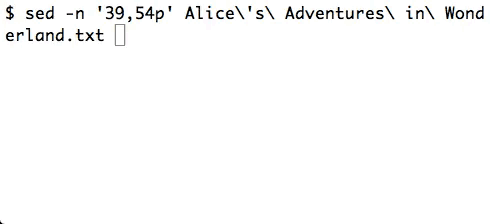

Readline Incdec
===============

Readline bindings to increment and decrement numbers on the command line.

## Demo
The commands increment or decrement the closest number to the left of point. If
point is to the left of the first number in the line, the first number is
modified.

## Bindings
Default bindings are provided, but they can also be customised by adding them
manually. By default:

| Binding | Action    |
|---------|-----------|
| `C-x a` | Increment |
| `C-x x` | Decrement |

## Install
Mac OS X users can install with Homebrew:

	$ brew install teddywing/formulae/readline-incdec

Or with MacPorts, after [adding a custom repository source][teddywing ports
repository]:

	$ sudo port install readline-incdec

On other platforms, download the `incdec.bash` and, if desired,
`incdec-bindings.bash` files.

Then source the script in your Bash RC file:

	source /path/to/incdec.bash

To enable the default bindings, also add:

	source /path/to/incdec-bindings.bash

Custom bindings can be added in place of the defaults. For example, this defines
bindings for `C-x -` and `C-x +`:

	bind -x '"\C-x-": __readline_incdec_decrement'
	bind -x '"\C-x+": __readline_incdec_increment'

[teddywing ports repository]: https://github.com/teddywing/macports-ports#adding-this-repository-source

## License
Copyright © 2021–2022 Teddy Wing. Licensed under the GNU GPLv3+ (see the
included COPYING file).
